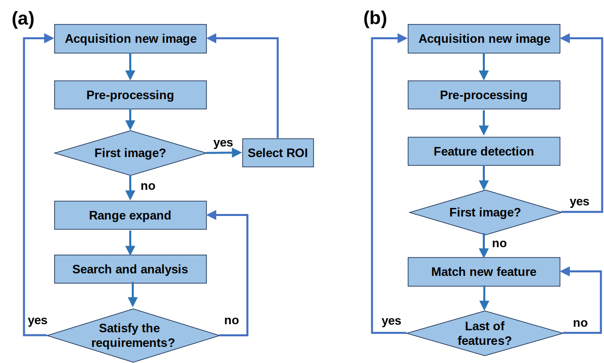

# openSPM
Some resources may be helpful to SPM users. For example, scan images process scripts, simulation model codes.
This project mainly use python.

## file read and image process

[sxm read](sxm_process)

## drift meassure
  - [fearture match by ROI](drift_meassure/drift_cv)
  - [fearture match by fearture description](drift_meassure/drift_cv)

  

## atom tracking data analysis
[atom tracking trace](atom_tracking_data_analysis)

## gradient algorithm simulation
